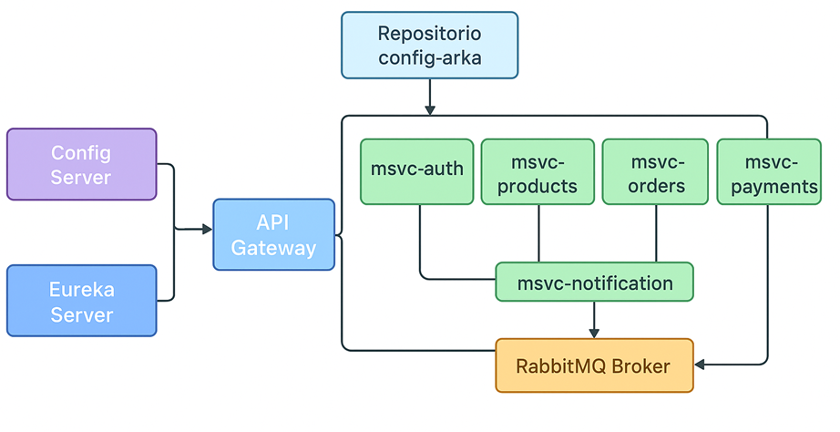
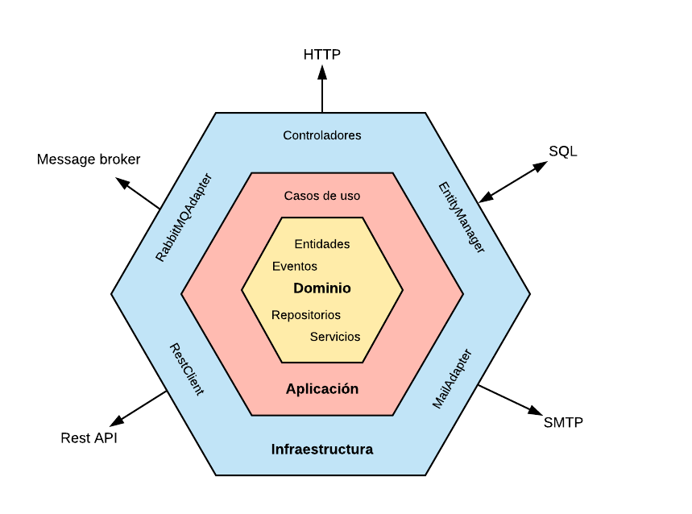

# Arquitectura del Software


En este proyecto se implemento una Arquitectura de Microservicios, desacoplando las funcionalidades de negocio en servicios pequeños y autónomos. El patrón de diseño interno de cada microservicio es la **Arquitectura Hexagonal (Ports & Adapters)**, asegurando la separación de preocupaciones, el **principio SOLID** y la independencia del dominio.

***

## 1. Modelo Arquitectónico de Microservicios

El sistema se compone de los siguientes microservicios, cada uno responsable de un dominio de negocio específico:

| Microservicio      | Funciones Principales                                                                      | Tecnologías / Dependencias                                    |
|:-------------------|:-------------------------------------------------------------------------------------------|:--------------------------------------------------------------|
| **Config Server**  | Servidorcentrl gestiona y distribuye configuraciones externas de todos los microservicios. | Spring Cloud Netflix Eureka Server.                           |
| **Eureka Server**  | Registro y descubrimiento de servicios                                                     | Spring Cloud Netflix Eureka Server.                           |
| **API Gateway**    | Entrada única, enrutamiento, control de acceso y balanceo de carga.                        | Spring Cloud Gateway, Eureka Client.                          |
| **Inventario**     | Productos, stock, logs de cambios definidos en los requerimentos. Reportes                 | Spring Data JPA, PostgreSQL.                                  |
| **Carrito**        | Gestión de carritos, ítems del carrito, abandono.                                          | Spring Data JPA, Feign Client (a Notificaciones).             | 
| **Pedidos**        | Órdenes de compra, ítems de órdenes, estados de orden .                                    | Spring Data JPA, **Feign Client** (a Inventario y Usuarios) . |
| **Pagos**          | Procesamiento de transacciones y estado de pagos.                                          | Feign Client (a Pedidos).                                     |
| **Usuarios**       | Login, roles, generación/validación de tokens (JWT), historial de compra.                  | Spring Security.                                              |
| **Notificaciones** | Envío de correos.                                                                          | Servicio de Correo Externo. RabbitMQ                          |




***


## 2. Componentes de Infraestructura y Enrutamiento

### 2.1. Descubrimiento de Servicios (eureka-server) 
El componente eureka-server es el registro central (Service Discovery) y opera en el puerto 87614. Su configuración principal deshabilita el registro en sí mismo y la obtención del registro 

### 2.2. API Gateway (msvc-gateway) 
El Gateway opera en el puerto 8090 y actúa como el punto de entrada principal. Está configurado como cliente de Eureka para utilizar el balanceo de carga del lado del cliente.

 #### Configuración de Conexión a Eureka (.yml)
```
client:
  register-with-eureka: true
  fetch-registry: true
  service-url:
    defaultZone: http://localhost:8761/eureka/
```

***
#### Rutas y Enrutamiento

El enrutamiento se realiza utilizando el nombre lógico del servicio registrado en **Eureka**.  
Se aplica el filtro `StripPrefix=1` para eliminar el prefijo de la ruta.

| ID de Ruta              | URI de Destino          | Patrón de Ruta          | Descripción                 |
|--------------------------|-------------------------|--------------------------|------------------------------|
| msvc-inventory           | lb://msvc-inventory     | /api/products/**         | CRUD de Productos, Historial de cambios stock            |
| msvc-inventory-categories| lb://msvc-inventory     | /api/categories/**       | CRUD de Categorías        |
| msvc-orders              | lb://msvc-orders        | /api/orders/**           | CRUD de Órdenes              |
| msvc-carts               | lb://msvc-carts         | /api/carts/**            | Gestión y creacion de Carritos          |
| msvc-payments            | lb://msvc-payments      | /api/payments/**         | Procesamiento de Pagos       |
| msvc-auth                | lb://msvc-auth          | /api/auth/**             | Login y Autenticación        |
| msvc-notifications       | lb://msvc-notifications | /api/notifications/**    | Envío de Alertas y Correos   |
***

## 3. Patrón de Diseño Interno: Arquitectura Hexagonal



Cada microservicio implementa la Arquitectura Hexagonal (Ports & Adapters) para garantizar el desacoplamiento total entre capas. La estructura de carpetas lógica es la siguiente:
```
├── MsvcApplication.java
├── application/
│   └── service/
│       ├── Service.java (Implementa IUseCase)
├── domain/
│   ├── model/
│   │   ├── DomainModel.java (Entidades de Negocio)
│   ├── ports/
│   │   ├── in/
│   │  │   ├── IUseCase.java (Port Primario - Lógica de Negocio)
│   │  └── out/
│   │      ├── IRepositoryPort.java (Port Secundario - Acceso a Datos)
├── infrastructure/
│   ├── mapper/
│   │   ├── IMapper.java (MapStruct - Domain/Entity/DTO)
│   ├── persistence/
│   │   ├── adapter/
│   │   │   ├── RepositoryAdapter.java (Implementa IRepositoryPort)
│   │   ├── entity/
│   │   │   ├── Entity.java (Modelos JPA/Base de Datos)
│   │   └── repository/
│   │       ├── IRepository.java (Spring Data JPA Repository)
│   └── web/
│       ├── controller/
│       │   ├── Controller.java (Adaptador Primario - REST)
│       └── dto/
│           ├── request/
│           │   ├── Request.java (DTO de Entrada)
│           └── response/
│               ├── Response.java (DTO de Salida)
│   └── security/
│       ├── AuthUser
│       ├── GatewayAuthFilter
│       ├── SecurityConfig
└── shared/
    ├── exception/
    │   ├── NotFoundException.java
    │   ├── GlobalExceptionHandler.java (Manejo de Errores)
    │  └── BusinessException.java
