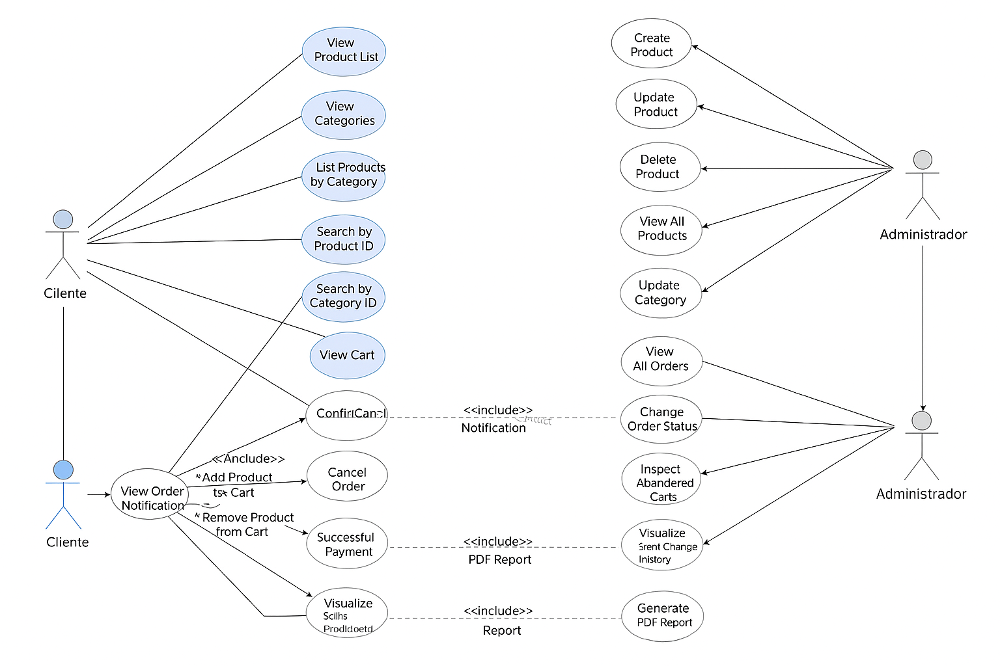

#  Especificación de Casos de Uso – Sistema Arka

## 1.  Actores y Alcance

Los actores primarios del sistema son:

- **CLIENTE**  
  Actor externo que interactúa con las funcionalidades de **compra**, **consulta de catálogo(productos, categorias)** y **gestión de su orden personal**.

- **ADMINISTRADOR**  
  Actor interno con privilegios de **gestión de backend** (inventario, productos, categorias, órdenes generales y reportes analíticos).

---

## 2. 🧩 Modelado de Casos de Uso

El siguiente modelo conceptualiza las **interacciones primarias del sistema**, asegurando **trazabilidad** y **coherencia** con las Historias de Usuario (HU) definidas.

| **Actor** | **Caso de Uso Principal (CU)** | **Casos de Uso Incluidos (Extend / Include)** | **HU Asociadas** | **Descripción Técnica / Justificación** |
|------------|--------------------------------|-----------------------------------------------|------------------|------------------------------------------|
| **Ambos** | Iniciar Sesión | `<<Include>>` Autenticar Credenciales | - | Punto de acceso seguro al sistema. El **ADMIN** está pre-registrado; el **CLIENTE** debe registrarse previamente. |
| **CLIENTE** | Gestión de Carrito y Orden de Compra | `<<Include>>` Visualizar Catálogo, `<<Extend>>` Gestionar Pago, `<<Include>>` Recibir Notificación de Orden | HU4, HU5, HU6 | Núcleo transaccional: inicia con la navegación (visualizar/buscar) y culmina con la confirmación del carrito. Implica **reserva de stock** (proceso crítico backend). |
|  | Visualizar Catálogo | `<<Include>>` Visualizar Lista de Productos, `<<Include>>` Listar Productos por Categoría, `<<Include>>` Buscar Producto/Categoría por ID | - | Mejora la **usabilidad** del sistema para la selección de artículos. |
|  | Gestionar Carrito | `<<Include>>` Agregar Producto, `<<Include>>` Cambiar Cantidad, `<<Include>>` Eliminar Producto, `<<Include>>` Confirmar Carrito (Checkout) | HU4, HU5 | Manejo de la sesión de compra garantizando la **integridad de datos** y **validación de stock en tiempo real**. |
|  | Gestionar Pago | `<<Extend>>` Cancelar Orden (Antes de Pago), `<<Include>>` Recibir Notificación de Pago y Estado | HU6 | Flujo de cierre transaccional. El éxito/falla actualiza el estado de stock (**VENDIDO / DEVUELTO**). |
| **ADMIN** | Gestión de Inventario y Catálogo | `<<Include>>` Crear / Actualizar / Eliminar Producto o Categoría, `<<Include>>` Visualizar Stock (General) | HU1, HU2 | Garantiza la **consistencia del catálogo** y la mantenibilidad del sistema. |
|  | Gestión de Órdenes Globales | `<<Include>>` Buscar Órdenes, `<<Include>>` Actualizar Estado de Orden, `<<Include>>` Revisar Carritos Abandonados | HU6, HU8 | Asegura la **trazabilidad completa del ciclo de vida de la orden** y la optimización de ventas. |
|  | Generación de Reportes | `<<Include>>` Visualizar Historial de Ventas, `<<Include>>` Generar Reporte PDF (Ventas), `<<Include>>` Generar Reporte PDF (Cambios de Stock) | HU3, HU7 | Función de **inteligencia de negocio**. Entrega métricas clave para decisiones sobre abastecimiento y performance comercial. |

---

> **Diagrama:**  

---
