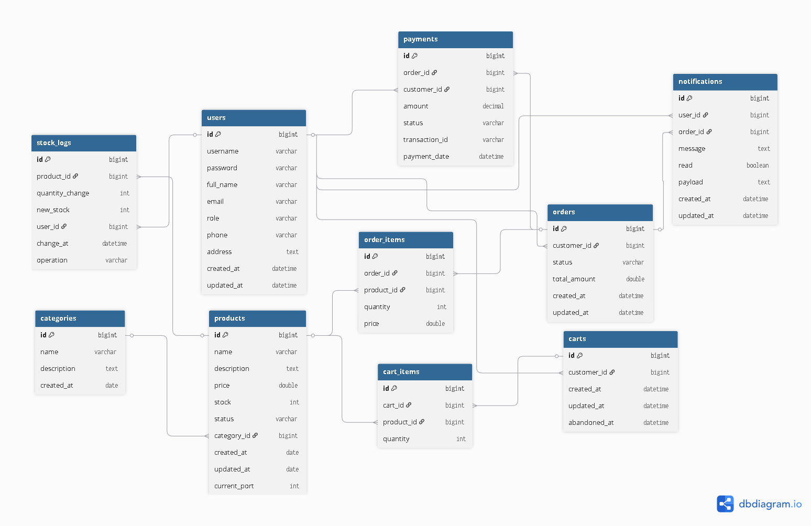

# Diagrama Entidad-Relación (DER)

La persistencia de datos del sistema Arka se gestiona mediante una base de datos relacional (PostgreSQL), siguiendo Base de Datos por Microservicio.
## 1. Diagrama Entidad-Relación (DER)

El siguiente diagrama conceptual de **Entidad-Relación (DER)** ilustra las entidades primarias del sistema (Productos, Usuarios, Órdenes, Historial de Stock, Pagos, Notificaiones y Carritos) y sus relaciones lógicas.

## 2. Esquema Relacional

El esquema de la base de datos se compone de las siguientes tablas, con sus atributos clave y relaciones:

| Tabla | Propósito | Relaciones Clave |
| :--- | :--- | :--- |
| **users** | Almacena clientes y administradores. | N:1 con `stock_logs` (user_id). 1:N con `notifications`. |
| **categories** | Clasificación de productos. | 1:N con `products`. |
| **products** | Catálogo de productos. | 1:N con `stock_logs`, `order_items`, `cart_items`. |
| **stock_logs** | Historial de cambios de inventario. | N:1 con `products` y `users`. |
| **orders** | Órdenes de compra finalizadas. | 1:N con `order_items`. 1:N con `notifications`. |
| **order_items** | Detalle de productos en una orden. | N:1 con `orders` y `products`. |
| **carts** | Carritos de compra. | 1:N con `cart_items`. |
| **cart_items** | Detalle de productos en un carrito. | N:1 con `carts` y `products`. |
| **notifications** | Registro de notificaciones de estado. | N:1 con `users` y `orders`. |

