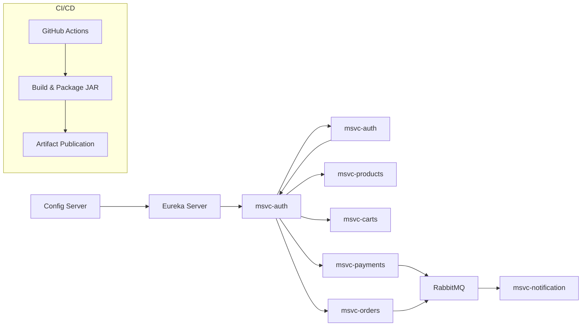

# Flujo de Despliegue y Configuración – Arka Cloud

Este documento describe el flujo completo de configuración, despliegue e integración continua de la arquitectura basada en microservicios de **Arka Cloud**.

---

## 1. Configuración Centralizada

Cada microservicio carga su archivo `bootstrap.yml`, donde se define:

```yaml
spring:
  application:
    name: msvc-<nombre-servicio>
  cloud:
    config:
      uri: http://localhost:8888
```

- Las configuraciones específicas se almacenan en el repositorio central:
  ```
  config-arka/config/
  ```
- Ejemplo de configuración:
  ```
  msvc-orders-dev.yml
  msvc-payments-dev.yml
  msvc-gateway-dev.yml
  ```

---

## 🧰 2. Repositorios y Estructura de Configuración

Organización principal en GitHub:

```
arka-cloud/
│
├── arka-config-server/       → Servidor de configuración
├── arka-eureka-server/       → Registro de servicios
├── arka-gateway/             → API Gateway
│
├── arka-msvc-auth/           → Servicio de autenticación JWT
├── arka-msvc-products/       → Servicio de productos
├── arka-msvc-carts/          → Servicio de carritos
├── arka-msvc-orders/         → Servicio de órdenes
├── arka-msvc-payments/       → Servicio de pagos
├── arka-msvc-notification/   → Servicio de notificaciones (RabbitMQ)
│
└── config-arka/              → Repositorio central de configuración
    ├── msvc-auth-dev.yml
    ├── msvc-products-dev.yml
    ├── msvc-carts-dev.yml
    ├── msvc-orders-dev.yml
    ├── msvc-payments-dev.yml
    ├── msvc-notification-dev.yml
    └── msvc-gateway-dev.yml
```

---

## ⚙️ 3. Flujo de Integración Continua (CI/CD)

Cada microservicio implementa un flujo CI/CD mediante **GitHub Actions**, definido en:

```
.github/workflows/ci.yml
```

### 🔧 Pasos Estandarizados:

1. **Checkout del código fuente**
   ```yaml
   - uses: actions/checkout@v4
   ```

2. **Configuración del entorno**
   ```yaml
   - name: Set up JDK
     uses: actions/setup-java@v4
     with:
       java-version: '21'
       distribution: 'temurin'
   ```

3. **Compilación y empaquetado**
   ```yaml
   - name: Build with Gradle
     run: ./gradlew build -x test
   ```

4. **Publicación del artefacto**
   ```yaml
   - name: Upload Artifact
     uses: actions/upload-artifact@v4
     with:
       name: msvc-jar
       path: build/libs/*.jar
   ```

---

## 🧭 Resumen del Flujo General



---

📘 **Autor:** Equipo de Arquitectura – *Arka Cloud*  
📅 **Última actualización:** Noviembre 2025  
🏷️ **Versión del documento:** v1.0
